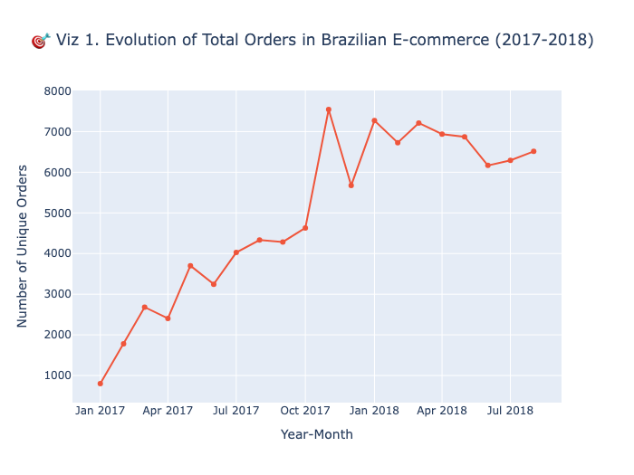
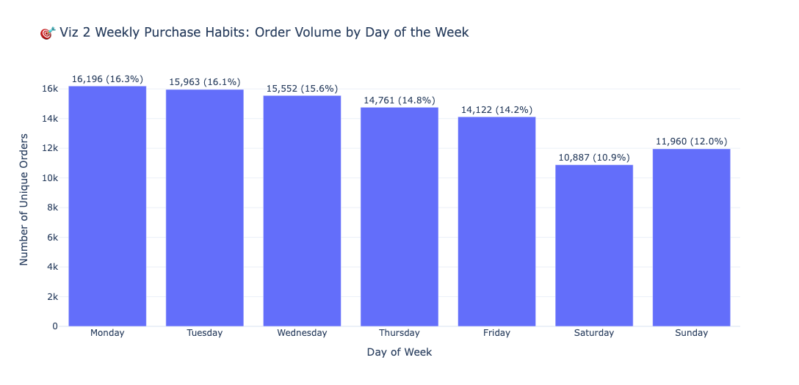
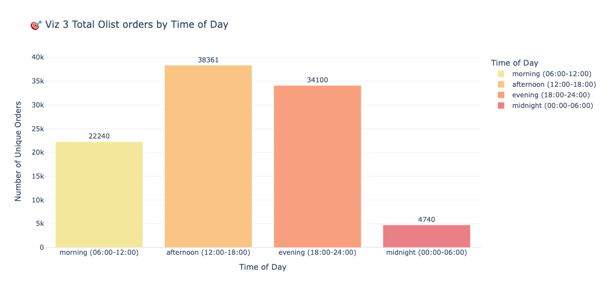

# Olist Brazilian E-Commerce - Interactive BI Dashboard

## 🎯 Project Overview
This repository contains a production-grade interactive Business Intelligence (BI) dashboard built using **Python, Plotly, and Dash**. The project transforms real-world, anonymized commercial transactions from the Olist Store (2016-2018) into actionable supply chain, logistics, and revenue optimization insights.

*This project is developed as part of the MIS 667A Advanced Business Intelligence graduate course.*

## 📊 Dataset Metadata Summary
* **Data Source:** Olist Brazilian E-Commerce Dataset (Kaggle)
* **Dataset Scale:** 112,650 rows (satisfied the 100+ row requirement)
* **Core Metrics (Numerical):** `price`, `freight_value`
* **Core Dimensions (Categorical):** `order_id`, `seller_id`, `product_category_name_english`
* **Hierarchical Structure:** `product_category_name_english` (Top Level) $\rightarrow$ `product_id` (Sub Level) for Chained Callbacks.
* **Temporal Indicator:** `shipping_limit_date` (Upgraded to multi-dimensional temporal indicators for Phase 2)

## 🛠️ Project Roadmap
- [x] Phase 1: Dataset Sourcing, Assessment, and Localization (English Translation)
- [x] Phase 2: Relational Schema Merging & Advanced Temporal Engineering (Week 3 Focus) 🚀
- [ ] Phase 3: Dashboard Layout Grid Design (Rows & Columns UI Blueprint)
- [ ] Phase 4: Chained Callback & Multi-Input Optimization Integration
- [ ] Phase 5: Final Production Deployment & Video Walkthrough

---

## 📈 Phase 2 Update: Core Visual Components & Data Engineering (Week 3)
In this sprint, the repository has been upgraded with core Plotly Express visualization components and rigorous backend data engineering, laying the analytical foundation for the upcoming Dash components.

### 1. Advanced Temporal Feature Decomposition
* Created structured time-dimension features (`Month`, `Day_of_Week`, `Hour`, `Time_of_Day`) out of the raw order timestamps to capture seasonal and cyclical purchasing patterns.
* Applied `pd.Categorical` to enforce strict chronological alignments (e.g., *Monday → Sunday* and *Morning → Midnight*), overriding Plotly's default alphabetical rendering.

### 2. Dual-Metric Label Engineering
* Designed an optimized Pandas `.apply(axis=1)` and `lambda` formatting workflow to combine absolute order volumes and relative percentage market shares into custom HTML data labels (` `) injected directly onto visual elements.

### 3. Key Plotly Express Renders Developed
* **Viz 1 (Platform Evolution Trend):** Continuous time-series line plot mapping the macro growth velocity and capturing the massive historical volume outlier during **Black Friday 2017**.

* **Viz 2 (Weekly Purchase Habits):** Ordered bar chart showing a mid-week transactional clustering effect (peaking Monday through Wednesday).

* **Viz 3 (Diurnal Purchasing Patterns):** Low-saturation gradient bar chart capturing the bimodal customer engagement peak hours (13:00 - 16:00 and 20:00 - 22:00).

